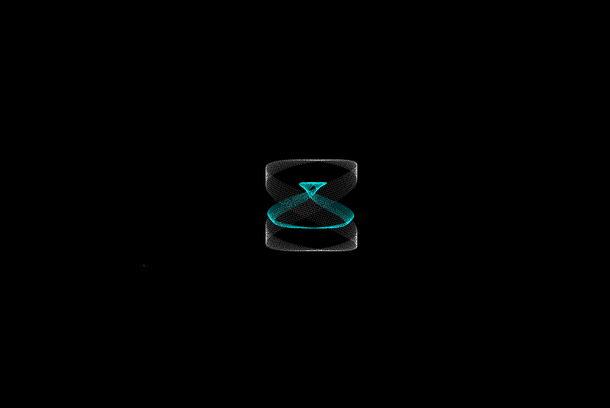

#   Trigonometric Function Visualizer 

I dont know if this name suits what im doing here 

### The trig function visualizer or as i like to call it wave-visualizer offers the power to visualize how waves or points behave when defined by any arbitrary trigonometric function . 

You might ask yourself " Well what can it do ?" 
-   Utmost Level of Control from the UI
-   Visualize any Trig functions in real time 
    - change amplitude 
    - change time 
    - change the frequency 
    - colour 
    - and some things
- Quite light and ..... well decently fast ??
- Support for adding multiple independent trig functions
- and many other things 

Caveats ? Or shortcomings ? 
- The rendering is not the most efficient or the most pretty . Im considering switching to opengl for more high quality and performant rendering .
- The code is nowhere near optimized if you were to add multiple independent oscillators your performance could suffer.
- Currently my programme only supports line and point based oscillators .
- The level of control is kinda 1 dimensional , you would have to manually tweak the parameters around to simulate any complex time or something based oscillator? 
- Although I could add some scripting capabilities with lua or python?
- The code is coming from a person with a few months of experience so it might be very bad.
- The whole programme was written over a 4 day break i had.
- I am a C programmer , so that means my preference is C , although i could have achieved the same results in cpp , im not familiar with it and the sole reason why cpp is in the project is because i needed imGUI.

## Dependency 
- DearImgui
- SDL3

So make sure to have these libraries if you want to compile the project

## Some Examples 
### 1. A pattern which looks like a rocket blasting propelents

This is an example preset that i came across while setting up different parameters .
It is made by using a line by definning sin -cos -sin tan for the point1 x and y , point2 x and y .
Whats visible is only the mid point of this line .

### 2. A hair or fabric like pattern

### 3. Quite an interesting harmony between mid point and one end point

Make sure to try them out , pictures dont do justice to this beautifull patterns

## A little thing to keep in mind about the rendering 
The way my application handles rendering is pretty much decided by the time step , increasing the time step will make or break patterns. 

In this case the full path of the wave is not properly disclosed , when the time step gets larger and larger the trigonometric waves will start
jumping around ,so you will get some interesting patterns when this jump happens . 

Also most of my examples are dominated by line oscillators , in any case a line oscillator is a line definned by 4 independent trigonometric functions
and you have the option to render it quite differently 
- the mid point of the line 
- the end point of the line 
- the starting point of the line 

Also you get the option to declare different colours for all of them .

In the future maybe ill add a way to render from the mid point to the end or start point .

# A Little about myself 
It started when i found out that definning x and y position as cos and sin in a 2d plane can create a circle , i was so happy and wanted to see what else could functions of x and y create .

Basically the formulae that lead to all of this is :

    basex + amplitude * cos(t);
    basey + amplitude * sin(t);

where base is the origin point , amplitude is how large i wanted it to be , and t is time ( atleast in my own words ) .

As a result i have found out so many beautifull patterns , and it made me so happy and i wanted to share it with other people too . 

If you found out some cool patterns ... consider sharing them with me or with other people , uploading them on reddit or sending me an email would be great . If you have any ideas for improvement , feel free to reach out to me .

witherarch@gmail.com

The end.
